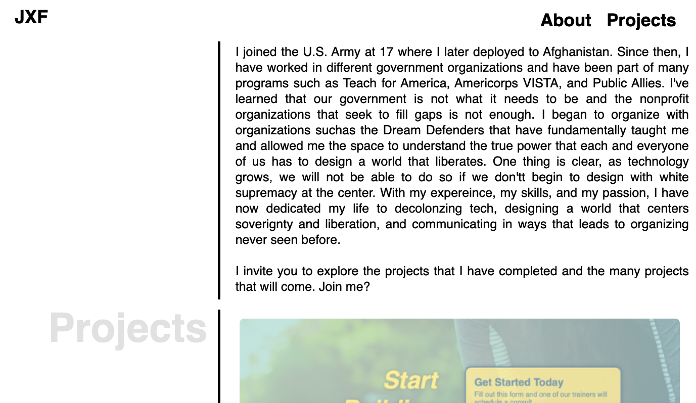
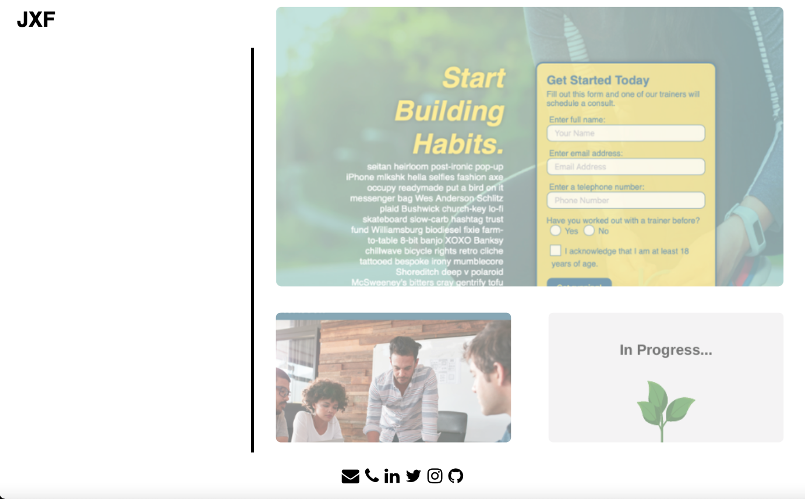

# Jonathan Xochimej Flores Professional Portfolio
> This site is to showcase the projects I have and will be completing during the UT Coding Bootcamp and beyond.

## Table of contents
* [General info](#general-info)
* [Team members](#team-members)
* [Technologies](#technologies)
* [Screenshots](#screenshots)
* [View updates](#view-updates)
* [Suggestions](#suggestions)

## General info
Having a portfolio site is key to making someone more visible and organizing all thier work they have accomplished over time. In this project, I have created an intial desing that includes an About and a Projects section. This will be continued to be worked on as I learn and accomplish. 

## Team members 
Jonathan G. Flores :technologist: 
>You can find me on [Linkedin](https://www.linkedin.com/in/brownradical "Add me on Linkedin") or email me at <jgflores35@gmail.com>
	
## Technologies 
Project is created with :computer: :
* Visual Studio Code version: 1.54.3
* Terminal version: 2.11
* Google Chrome version: 89.0.4389.72
* GitHub

## Screenshots 
The following screenshots are what the website currently looks like :camera_flash: :

	
## View updates
To view the website live, go to: https://brownradical.github.io/thedecolonialportfolio/ or to open Github repository files on a browser, go to: https://github.com/brownradical/thedecolonialportfolio.git
